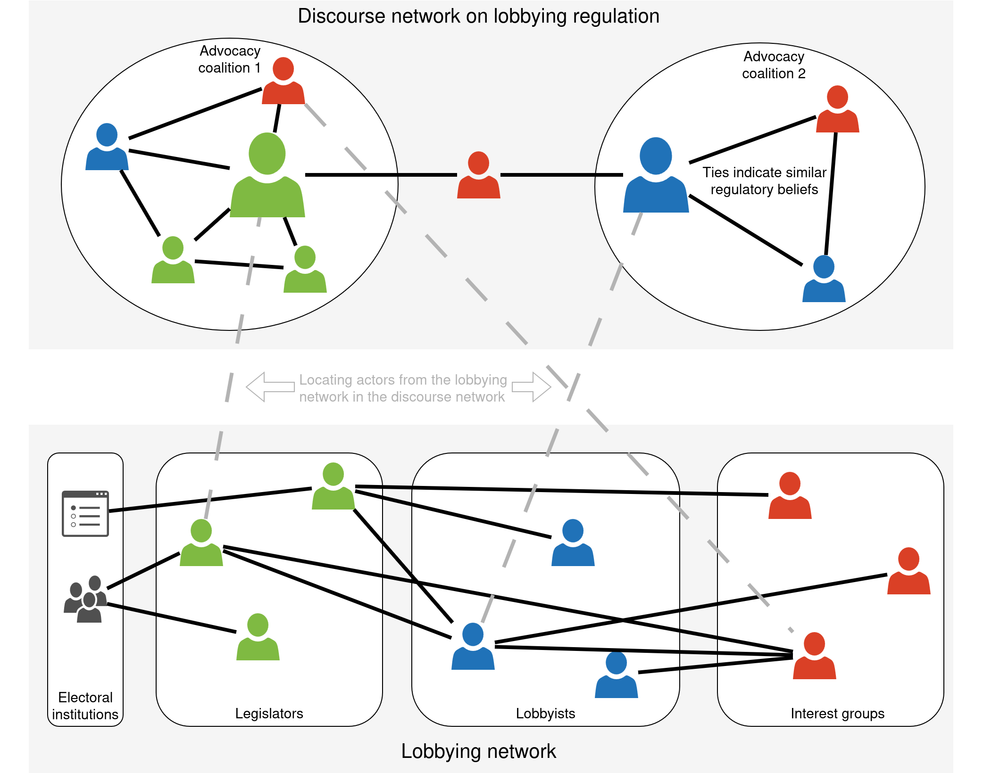

# Understanding and Regulating the Complex Network of Lobbyists and Legislators

## Background

Transparency and accountability are cornerstones of liberal democracy. Transparency refers to the openness and accessibility of government information and actions by citizens; accountability means that politicians and civil servants must explain their actions and face consequences if they do not play by the rules (Ashworth et al 2017; Besley 2006). Private interest lobbying can sometimes collide with these two values (Holman & Luneburg 2012), and lobbying regulation accordingly tackles one or both of these criteria to achieve effective lobbying regulation.

Lobbying is the provision of information by private interests, such as firms, associations, or charities, to public officials, typically legislators or bureaucrats, to influence legislation, regulation, or policy decisions (Austen-Smith 1993). Lobbying can take place through interactions between interest groups and public officials, possibly via professional lobbyists (“inside lobbying”) or through instigating public pressure on the government (“outside lobbying”) (Weiler & Brändli 2015). Here, we focus on legislative inside lobbying. Inside lobbying is usually legal, institutionalised, and invited because governments depend on private information to regulate and govern effectively (Chari et al 2019; Holman & Luneburg 2012). However, it tends to take place away from public scrutiny and provides incentives for transactions in which legislators receive an advantage from lobbyists in exchange for preferential treatment, undermining both transparency and accountability (Holman & Luneburg 2012).

The relationships between citizens and legislators (Barro 1973; Ferejohn 1986) as well as between private interests and the lobbyists they hire (Lowery and Marchetti 2012) have been modelled as principal-agent relationships, in which the agent evades the oversight by the principal to seek private rents. In a similar vein, interest groups have been conceptualised as network brokers between their constituents (members, clients) and legislators (Heaney & Strickland 2017). Democratic institutions, especially mechanisms that enhance transparency, mitigate principal-agent problems in two ways: by providing principals with information to evaluate and choose agents who are trustworthy representatives (“electoral selection”; Ashworth et al 2017; Geys & Mause 2012), and by subjecting agents to public scrutiny, where the threat of electoral sanction serves as a deterrent against opportunistic behaviour (“effective accountability”; Ashworth et al 2017; Besley 2006, chapter 3).

The policy instruments used to regulate lobbying, which have been the subject of policy debate on regulatory reform, show significant cross-country variation (Chari et al 2019). Some countries, such as Germany, prioritise transparency over accountability. In Germany, legislators can legally hold multiple jobs (“moonlighting”) but must disclose these jobs publicly on the website of the German parliament (Geys & Mause 2012). Germany also strengthened transparency significantly by introducing a public lobbying register, requiring all lobbyists to document their activities and ties to clients and legislators publicly. However, Germany has been criticised for lax anti-corruption laws (Wolf 2013).

In contrast, the United Kingdom (UK) is a frontrunner in introducing anti-corruption measures, such as the Anti-Bribery Act 2010, and maintaining accountability, for example through the UK Parliament Committee on Standards or the Parliamentary Commissioner for Standards (Dávid-Barrett 2022). However, it has relatively low transparency. For example, it has a flawed and partial lobbying register (Chari et al 2019; Solaiman 2023), and its exit from the European Union has created an institutional vacuum in lobbying regulation (Cottakis 2020).

These case differences beg the question of whether legislators and lobbyists can influence lobbying regulation in different ways in these complementary cases. To understand the regulation of lobbying, we must first understand how legislators dock onto the network of lobbyists and their client organisations and then how the complex network of legislators, lobbyists, and clients aligns with the structure of the policy debate on lobbying regulation. Policy debates can be measured as networks of political actors and the normative policy beliefs they share (Leifeld 2017; Leifeld & Brandenberger 2025). To understand the formation of advocacy coalitions (Weible & Sabatier 2018) and opinion leadership in the debate on lobbying regulation in the two countries, we need to locate the important nodes from the complex lobbying network in the discourse network on lobbying regulation. We call this network of lobbyists, legislators, and clients and their involvement in the regulation of lobbying the “legislative-private interest complex”. The overarching aim of the project is to understand how this complex operates.

Institutional theory would predict that electoral institutions shape how legislators connect to the network of lobbyists and clients. We see institutional differences in how legislators are voted into office both across and within countries. To explain different foci in lobbying regulation, we will investigate if and how institutional differences between legislators make a difference for their lobbying network embeddedness and trace whether how and such structural differentials loop all the way through to differences in opinion leadership in the regulatory discourse network. We will employ state-of-the-art higher-order statistical network modelling to account for the causal arrows in this complex social system. This analysis will create a comprehensive understanding of the legislative-private interest complex through the use of computational social science and network science approaches.

## Goals and research questions

This analysis serves four goals and answers four corresponding research questions (RQ):

**Goal 1**: Understanding and mapping the structure of the complex network of legislators, lobbyists, and their clients by linking different data sources through common entities and applying exploratory network analysis and visualisation to the linked network dataset.

**RQ 1**: What are the structural properties of the lobbying network, and how can we explain this structure?

**Goal 2**: Testing if electoral institutions make a difference for how prominently legislators become connected to the lobbying network. Electoral variables on which legislators differ are, for instance, constituency-based versus party list-based election, close versus generous winning margin, information on legislators’ party endorsements, and term-based or lifelong mandate in a bicameral system.

**RQ 2**: Does variation in how legislators are elected make a difference for how they form lobbying ties, leading to network embeddedness, and for the network structure emerging from these ties?

**Goal 3**: Explaining the structure of the regulatory policy debate on lobbying and standards in the parliament and media to understand how lobbying regulation comes about. The structure includes advocacy coalitions and their expressed policy beliefs, brokers and opinion leaders and their policy preferences, and the structural evolution of the discourse network over time. We aim to explain central roles of actors in the regulatory discourse network by their network embeddedness in the lobbying network (and ultimately their institutional characteristics, which may have shaped their lobbying network embeddedness).

**RQ 3**: Does the network embeddedness of actors in the lobbying network shape their role in the discourse network on lobbying regulation?

**Goal 4**: Identifying roadblocks to transparency- and accountability-enhancing lobbying regulation and proposing solutions given the understanding developed in Goals 1--3. We compare the findings between two complementary cases, the UK and Germany, which place a different emphasis on the role of transparency versus accountability in regulating lobbying and also have different electoral institutions. We aim to derive optimal institutional designs based on counterfactual simulations of different institutions in the two cases.

**RQ 4**: Which institutional designs would stimulate the national discourse on lobbying regulation in order to make a positive difference for democracy?

## Data

The **German case** will link five data sources. First, the lobby register was created in 2021 and requires all lobbyists to create records on their activities, clients, interests, and many other variables. The data are available in a machine-readable JavaScript Object Notation (JSON) format from the website of the German parliament and can be easily converted into a network dataset linking lobbyists with private interest organisations as well as legislative proposals, with resources, topical interests, and other variables acting as nodal attributes for lobbyists and clients.

Second, the biographies and paid affiliations of legislators with private interest organisations are listed on the website of the German parliament and can be scraped using computational social science tools in R, Python, or Artificial Intelligence (AI)-supported software tools. The lobby register and biography and affiliation data for the legislators will both be saved in a Structured Query Language (SQL) database as separate groups of tables and linked via a common table for private interest organisations. This permits the creation of a merged complex network with ties among three groups of actors: lobbyists, legislators, and private interest organisations. The legislator biographies on the Bundestag website also contain details on electoral institutions, such as whether a legislator was voted into office through proportional representation or by their constituency. These legislator covariates will be saved in the joint SQL relational database and used as node attributes in the network.

Third, the Bundestag website further contains details on committee memberships and various other activities, in addition to roll call vote records, which will all be saved in the database alongside the other information and linked to the network via primary keys for legislators, committees, and bills.

Fourth, the Bundestag archive will be searched for plenary debates and other speech or questions and answers on lobbying regulation using a suitable keyword search string. The speeches will be loaded into the software Discourse Network Analyzer (DNA; https://github.com/leifeld/dna, accessed 4 August 2025), which was created by the main applicant, and saved in the SQL database as well using a common primary key.

Fifth, a selection of news media sources (e.g., via Factiva or Lexis Nexis databases) and/or press agencies will be searched using the same keyword string over the same time frame as the parliamentary search, likely from around 2010 to the present to capture important recent reforms. The resulting articles will be saved in DNA and the SQL database.

The **UK case** will link six data sources. First, the searchable statutory Register of Consultant Lobbyists (RCL), the UK equivalent of the German lobby register, is maintained by the Office of the Registrar of Consultant Lobbyists (ORCL) and was set up by the Transparency of Lobbying, Non-Party Campaigning and Trade Union Administration Act 2014. It contains more sparse data than the German equivalent (Chari et al 2019; Solaiman 2023) but will be used in a similar way as far as possible.

Second, the UK Lobby Register (UKLR) is a private and voluntary but open-access lobby register operated by the Chartered Institute of Public Relations (CIPR). It was created voluntarily by the industry to create more transparency and complement the statutory lobby register, which is more narrow in scope. Data about lobbyists and their clients will be queried from both databases and merged as part of the SQL database to make up for the individual weaknesses of each data source. Both data sources are less detailed than in the German case, but this step mitigates data sparsity significantly.

Third, the Register of Members’ Financial Interests (RMFI) identifies Member of Parliaments’ (MPs’) outside earnings, second jobs, directorships, and other financial interests, and the parliamentary biography pages contain legislators’ voting history, committee memberships, and biography details. These data will be saved in the SQL database and matched with the remaining legislator data in a way similar to the German case.

Fourth, the House of Commons maintains an up-to-date Register Of All-Party Parliamentary Groups (APPG), including their private funding sources and leading members. APPGs have a reputation as lobbying vehicles outside of the RMFI and RCL and largely under the public radar (Hine & Peele 2016: 202ff). We will link the funding organisations with the private interest groups and firms in our database and the associated MPs to provide a more complete picture of the legislative-private interest complex.

Fifth, parliamentary speech on the topic of lobbying regulation in Hansard debates will be collected from the Hansard archive, the official open-access record of the UK Parliament, in a similar way as in the German case. The Hansard archive contains relevant speech in debates (plenary sessions), Prime Minister’s Questions (PMQ), consultation procedures on lobbying regulation, and possibly other formats. These policy debate data will be saved in the SQL database and DNA for annotation of the regulatory policy debate on lobbying.

Sixth, like in the German case, suitable newspaper or press agency articles will be collected using Factiva or Lexis Nexis and annotated using DNA, to create comparable data structures to the German case for analysis and comparison.
Where copyright and ethical considerations permit, the database will be released to the public at the end of the project after a suitable embargo period to permit project-based publications. The release of the data constitutes an additional public good created by the project.

## Methods

Separate analyses will be conducted for the two cases, and the results will be compared. First, we will create the lobbying network, composed of legislators, their institutional characteristics, lobbyists, and interest groups, by merging some of the data sources into a multimodal network.

The legislative speech and media articles will be annotated for discourse network analysis (Leifeld 2017; Leifeld & Brandenberger 2025) by coding normative political statements about lobbying regulation, including the person who speaks, the organisation or party the person belongs to, the normative policy belief the actor mentions, and a binary variable indicating whether the actor supports or rejects the policy belief. In discourse network analysis, these variables are used to create “congruence networks” showing which actors are aligned in the same emergent advocacy coalitions in the debate, which conflicts and fault lines develop, which actors are opinion leaders or followers, and which policy beliefs are most central, contested, or contagious in the debate. Together, these analyses permit an assessment of the temporal development of the structure of the debate and the roles of individual actors and policy beliefs therein. The actors, documents, and policy beliefs are linked to the SQL database using primary key indices so they can be merged into a higher-order network (Lambiotte et al 2019) containing all separate parts. The merged network containing the discourse network and the lobbying network and the links between them constitutes the legislative-private interest complex (shown in the diagram below).

The networks that can be created using queries and transformations based on the database are inherently multilevel and multimodal because they connect different kinds of actors through lobbying and client ties but also actors of the same kind through common committees, bills, topics, policy beliefs, etc. They are partially temporal: The policy debate is recorded longitudinally while the remaining data are partially time-ordered, and this needs to be accounted for in the data analysis. Multi-level, multi-layer, multi-body, temporal networks have been called “higher-order networks” (Lambiotte et al 2019) to denote their complex dependency setup. Distinguishing between the table-based data representation in the SQL (or potentially graph) database and the respective network or dataset to be analysed allows us to query the database for exactly the kind of data structure that is required for the respective analysis step, including increasing complexity at later stages of the analysis. We will then apply statistical network analysis to these resulting higher-order networks.

Exploratory higher-order network analysis and cutting-edge statistical models for higher-order networks will be employed to answer the research questions, including higher-order and co-evolutionary extensions of the exponential random graph model (ERGM), such as the exponential random network model (ERNM; Clark & Handcock 2024), multi-level ERGM (Krivitsky et al 2020; Wang et al 2013), and temporal ERGM (TERGM; Leifeld et al 2018), as well as relational event models (REM) for joint modelling of multiple types of actors and tie events (Leifeld & Brandenberger 2025; Vieira et al 2024). Custom models will be implemented in C++ to push the boundaries of combining both temporal and multilevel dependence in a joint model. The goal of these statistical higher-order network models is to develop a comprehensive understanding of how institutional effects and other covariates loop through from the level of legislators via the complex lobbying network all the way to the differences they make in the regulatory policy debate. Network analysis serves as a common data representation for joint modelling of these complex processes.

Causal inference techniques under the potential outcomes framework will be additionally applied to the nexus between electoral institutions and legislators’ tie formation behaviour to create a higher bar for significance and cleaner design-based comparisons of institutions (Stoetzer et al 2025). However, as Stoetzer et al (2025) point out, causal inference with latent outcomes, such as network centrality or connection profiles in this case, requires additional assumptions, which need to be evaluated and implemented in this novel context.

Both causal inference with latent network outcomes and higher-order statistical network models are at the cutting edge of applied statistical methodology. Methodological innovations to analyse these complex data structures to support the substantive analysis will constitute a valuable by-product of the project.

## **Strand 1**: Exploration of the Lobbying Network

Strand 1 collects and links the different institutional data sources and draws a complete map of the legislative-private interest complex. We will explore the network of legislators, the interest organisations they are affiliated with, clients, employees, and peak associations, across recent legislation periods, addressing several questions: What are the cleavage lines, subsystems, and clusters in this network; who are the central players; what are the central topics (Box-Steffensmeier and Christensen 2015)? How do interest groups organise into informal coalitions in a parliamentary system (Heaney and Leifeld 2018; Junk 2019)? What explains the network structure? Exploring the legislative-private interest complex as a network in these ways addresses Goal 1.

## **Strand 2**: Institutional Foundations of the Network Embeddedness of Legislators

We will use the network map created in Strand 1 to explain why lobby groups nurture connections to legislators and vice-versa. Our hypothesis is that electoral institutions are associated with different levels of network embeddedness of legislators. We will test whether legislators’ institutional contexts lead to more paid affiliations and prominent positions in the lobbying network, measured using centrality indices for multi-layer and multi-level networks and proximity to lobbying coalitions (Strand 1). Methodologically, we will leverage exponential random network models for causal inference over stochastic networks (Clark & Handcock 2024) and causal inference techniques for latent variables (Stoetzer et al 2025) as well as tried and tested techniques.

Electoral institutions can vary within a country. Germany has a mixed-member electoral system: Some legislators are directly elected in single-member districts (SMDs) via plurality and the rest through proportional representation (PR). The direct accountability of legislators in SMDs leads to stronger pork barrel politics compared to legislators elected under PR. Indeed, research shows directly elected legislators seek out political and economic rents for their districts, both comparatively (e.g., Persson and Tabellini 2003; Gagliarducci, Nannicini and Naticchioni 2011; Rickard 2018), and in the German case (e.g., Stratmann and Baur 2002; Sieberer 2010; Becher and Sieberer 2008). We posit that this will translate into stronger lobbying network embeddedness with respect to local firms and causes but fewer ties overall.

There is no such formal variation in the UK’s first-past-the-post electoral system, hence the UK should be characterised by a more equal distribution of network embeddedness overall. However, more delicate institutional differences can likely be found in the UK, including different behaviour between MPs from marginal seats, who may focus more on constituents, and MPs in safe seats, owing more to party leadership. We may also find differences between candidates who were selected by a local party association and candidates selected by the national party leadership, though this part of the analysis may face data limitations (Butler et al 2025). Finally, Lords have no constituency role and may focus less on partisan or constituency obligations than MPs in the House of Commons, potentially leading to different lobbying connectivity and involvement in the regulatory debate altogether. Strand 2 will evaluate these logics with data for both cases and compare the results, answering RQ 2.

## **Strand 3**: The Politics of Lobbying Regulation

Strand 3 compares the agenda-setting dynamics and politics of lobbying regulation between the UK and Germany. Using discourse network analysis, a methodology invented by the applicant (Leifeld 2017; Leifeld & Brandenberger 2025), we will compare debates on strengthening transparency and accountability---“anti-sleaze” policies, as they have been termed in news coverage in recent years---during the last ca 15 years as temporal networks between the two countries. Analysis of the debates using discourse network analysis serves Goal 3 and answers RQ 3.

We will subsequently link a recent subset of these regulatory discourse networks to the legislator-lobbying networks from Strand 1 to examine whether and how the structure of the lobbying network translates into barriers to regulation of corruption and lobbying (Goal and RQ 4): Do central players in the lobbying network act as opinion leaders within discourse or advocacy coalitions (Weible and Sabatier 2018)? Actors with vested interests are expected to resist efforts to implement more restrictive policies. This will improve our understanding of the dynamics leading to more versus less legislation in the UK and Germany (Goal 3).

Building on estimated models of the policy debates and a qualitative understanding of the regulatory debate, we will then evaluate hypothetical counterfactual institutional regimes to test the aggregate effect institutional reform could make for more transparent and accountable lobbying regulation (Leifeld & Brandenberger 2025). On this basis, we can address Goal 4 and answer RQ 4 and draw conclusions about the anticipated efficacy of policies aiming to change the institutional rules to increase transparency or accountability.

## **Strand 4**: The Legislative-Private Interest Complex as a Higher-Order Network

State-of-the-art higher-order network science will allow us to analyse the different mechanisms and network layers jointly and in a time order-preserving manner (Scholtes 2017). The defining characteristic of a higher-order network is the simultaneous consideration of multiple actor types, relations, processes, and time (Lambiotte et al 2019). We will explain network formation using statistical network models by combining higher-order network science with another subfield of network science: statistical network analysis (Heaney & Leifeld 2019; Leifeld & Brandenberger 2025). With this combination (Clark & Handcock 2024; Krivitsky et al 2020; Leifeld et al 2018; Vieira et al 2024; Wang et al 2013), we need no longer assume exogeneity of all covariates (Clark & Handcock 2024). Instead, we can model the legislative-private complex as a single, multivariate observation (Krivitsky et al 2020; Wang et al 2013) and treat it as a complex system while maintaining the ability to estimate regression coefficients, resulting in novel contributions to both network science and political economy and strengthening the precision and validity of the insights gathered.

Modelling the legislative-private interest complex in a joint model across all data sources allows us to explain the phenomenon more comprehensively by linking the different mechanisms together, propagating uncertainty from one level in the analysis to the other levels, and preserving the temporal order of ties where applicable, leading to an improved understanding of the legislative-private interest complex. As a side-effect, we can innovate not only in the study of lobbying but also in the field of network science by combining methods in novel ways and applying them to a novel dataset. Doing so enables us to answer RQs 3 and 4 more comprehensively and rigorously and supports Goals 3 and 4.

## Outputs and Significance

We will publish in leading journals in political science (e.g., American Journal of Political Science, Quarterly Journal of Political Science, European Journal of Political Research), in political economy (e.g., Journal of Political Economy, European Journal of Political Economy, Review of Economics and Statistics), and in multidisciplinary and network science journals (e.g., Network Science, Journal of Statistical Mechanics, Science Advances). We expect to publish 12 articles and will present each one at conferences (e.g., EUSN, APSA, EPSA/EPSS).

These outputs will significantly improve our understanding of the structure of the legislative-private interest complex, the conditions under which legislators nurture private industry ties, and the barriers this complex creates for reform. The topic is important and timely as government “sleaze” has been a prominent topic in the news coverage of recent years (e.g., the prominent case of Rt Owen Paterson, who was found to have broken parliamentary lobbying rules by repeatedly acting as a paid lobbyist) and as public perceptions of standards of conduct in public life have slipped over the last 20 years (Hine & Peele 2016: 7). The project will model the legislative-private interest complex comprehensively and derive conclusions about how democratic oversight can be improved by altering the institutional setup.

## References

Ashworth, S., De Mesquita, E. B., & Friedenberg, A. (2017). Accountability and information in elections. American Economic Journal: Microeconomics, 9(2), 95-138.

Austen-Smith, D. (1993). Information and influence: Lobbying for agendas and votes. American Journal of Political Science, 37(3): 799-833.

Barro, R. J. (1973). The control of politicians: an economic model. Public Choice, 14: 19-42.

Becher, M. and U. Sieberer (2008). Discipline, electoral rules and defection in the Bundestag, 1983–94, German Politics, 17(3): 293-304.

Besley, T. (2006). Principled agents? The political economy of good government. Oxford University Press.

Box-Steffensmeier, J. M., & Christenson, D. P. (2015). Comparing membership interest group networks across space and time, size, issue and industry. Network Science, 3(1), 78-97.

Butler, C., Miori, M., & Ford, R. (2025). Inside the ‘secret garden’: Candidate selection at the 2019 UK general election. The British Journal of Politics and International Relations, 27(1), 242-269.

Chari, R., Hogan, J., Murphy, G., & Crepaz, M. (2019). Regulating lobbying: a global comparison. Manchester University Press.

Clark, D. A., & Handcock, M. S. (2024). Causal inference over stochastic networks. Journal of the Royal Statistical Society Series A: Statistics in Society, 187(3), 772-795.

Cottakis, M. (2020). After Brexit comes the battle for the soul of British democracy. LSE Blog, 4 February 2020. https://blogs.lse.ac.uk/brexit/2020/02/04/now-is-the-time-to-renew-uk-democracy/ (accessed 31 July 2025).

Dávid-Barrett, E. (2025). Shirking self-regulation? Parliamentary standards in the UK. Public Integrity, 27(2), 140-151.

Ferejohn, J. (1986). Incumbent performance and electoral control. Public Choice, 50(1): 5-25.

Gagliarducci, S., Nannicini, T., & Naticchioni, P. (2011). Electoral rules and politicians' behavior: A micro test. American Economic Journal: Economic Policy, 3: 144–174.

Geys, B., & Mause, K. (2012). Delegation, accountability and legislator moonlighting: Agency problems in Germany. German Politics, 21(3), 255-273.

Heaney, M. T., & Leifeld, P. (2018). Contributions by interest groups to lobbying coalitions. The Journal of Politics, 80(2), 494-509.

Heaney, M. T., & Strickland, J. M. (2017): A network approach to interest group politics. In: Victor, J. N., Montgomery, A. H., & M. N. Lubell (eds.): The Oxford Handbook of Political Networks (chapter 17, pp. 433-452). Oxford University Press.

Hine, D., & Peele, G. (2016). The regulation of standards in British public life. Manchester University Press.

Holman, C., & Luneburg, W. (2012). Lobbying and transparency: A comparative analysis of regulatory reform. Interest Groups & Advocacy, 1(1), 75-104.

Krivitsky, P. N., Koehly, L. M., & Marcum, C. S. (2020). Exponential-family random graph models for multi-layer networks. Psychometrika, 85(3), 630-659.

Lambiotte, R., Rosvall, M., & Scholtes, I. (2019). From networks to optimal higher-order models of complex systems. Nature Physics, 15(4), 313-320.

Leifeld, P. (2017): Discourse Network Analysis: Policy Debates as Dynamic Networks. In: Victor, J. N., Montgomery, A. H., & M. N. Lubell (eds.): The Oxford Handbook of Political Networks (chapter 12, pp. 301-325). Oxford University Press.

Leifeld, P., & Brandenberger, L. (2025). Endogenous coalition formation in policy debates. American Journal of Political Science, forthcoming, arXiv:1904.05327. https://doi.org/10.48550/arXiv.1904.05327 (accessed 4 August 2025).

Lowery, D., & Marchetti, K. (2012). You don’t know Jack: Principals, agents and lobbying. Interest Groups & Advocacy, 1(2), 139-170.

Persson, T. and G. Tabellini. 2003. The Economic Effects of Constitutions. Cambridge, MA: MIT Press.

Rickard, S. J. (2018). Spending to win: Political institutions, economic geography, and government subsidies. New York: Cambridge University Press.

Scholtes, I. (2017). When is a network a network? Multi-order graphical model selection in pathways and temporal networks. In Proceedings of the 23rd ACM SIGKDD international conference on knowledge discovery and data mining (pp. 1037-1046).

Sieberer, U. (2010). Behavioral consequences of mixed electoral systems: Deviating voting behavior of district and list MPs in the German Bundestag. Electoral Studies, 29(3), 484-496.

Solaiman, B. (2023). Lobbying in the UK: Towards Robust Regulation. Parliamentary Affairs, 76(2), 270–297.

Stoetzer, L. F., Zhou, X., & Steenbergen, M. (2025). Causal inference with latent outcomes. American Journal of Political Science, 69(2), 624-640.

Stratmann, T., & Baur, M. (2002). Plurality rule, proportional representation, and the German Bundestag: How incentives to pork-barrel differ across electoral systems. American Journal of Political Science, 46(3): 506–514.

Vieira, F., Leenders, R., & Mulder, J. (2024). Fast meta-analytic approximations for relational event models: Applications to data streams and multilevel data. Journal of Computational Social Science, 7(2), 1823-1859.

Wang, P., Robins, G., Pattison, P., & Lazega, E. (2013). Exponential random graph models for multilevel networks. Social Networks, 35(1), 96-115.

Weible, C. M., & Sabatier, P. A. (Eds.). (2018). Theories of the Policy Process. Routledge.

Weiler, F., & Brändli, M. (2015). Inside versus outside lobbying: How the institutional framework shapes the lobbying behaviour of interest groups. European Journal of Political Research, 54(4), 745-766.

Wolf, S. (2013). Political corruption as a regulatory problem in Germany. German Law Journal, 14(9), 1627-1638.